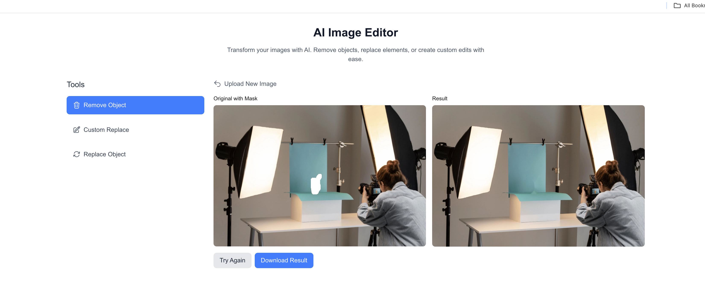

# TransformAI

<p align="center">
  
</p>

An AI-powered image editor that removes unwanted objects and replaces them with anything you can describe.

## Features

- **Remove:** Eliminate unwanted objects from images with a single click
- **Fill Anything:** Replace selected areas using simple text prompts

## Tech Stack

- Frontend: Next.js, React
- Backend: FastAPI, Python
- AI Models: SAM (Segment Anything Model), LaMa Inpainting

## Setup Instructions

### Prerequisites
- Python 3.10+
- Node.js 16+
- npm/yarn

### Backend Setup
1. Clone this repository
2. Download required models:
   - SAM model: Download [sam_vit_h_4b8939.pth](https://dl.fbaipublicfiles.com/segment_anything/sam_vit_h_4b8939.pth) and place in the backend directory
   - LaMa model: Download from [LaMa repository](https://github.com/advimman/lama) and place in `backend/pretrained_models/big-lama/`
3. Install backend dependencies:
   ```
   cd backend
   pip install -r requirements.txt
   ```
4. Start the backend server:
   ```
   python main.py
   ```
   The backend will run on port 8001.

### Frontend Setup
1. Install frontend dependencies:
   ```
   npm install
   ```
2. Start the frontend development server:
   ```
   npm run dev
   ```
   The frontend will be available at http://localhost:3000.

## Usage
1. Upload an image
2. Choose either "Remove" or "Fill Anything" mode
3. Mark objects to remove or areas to replace
4. For "Fill Anything", enter a text prompt describing what to add
5. View and download your edited image

## Known Issues
- The app currently uses basic rendering for complex prompts
- The dependency compatibility issue with Stable Diffusion and huggingface_hub might require specific version installations

## Team
Team Boulders - Hackathon 2025
